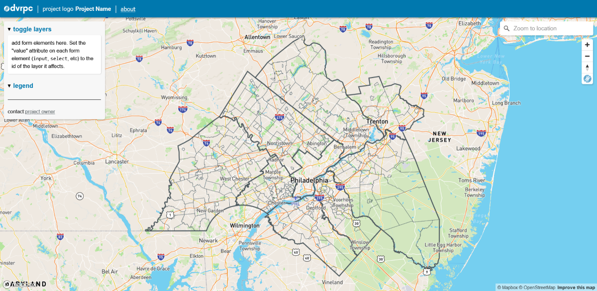

# Overlay Webmap Template

Copy this template to bootstrap a webmap with an overlay containing a form and legend area. Useful for projects with togglable and/or clickable layers that don't need space for text or data content (with the exception of project info, which can go in the about modal).
  
This template is new so no samples are deployed yet, but you can view [a working demo here](https://dvrpc.github.io/map-templates/).

## Demo
- spin up or browse through the `/demo/` folder to get a sense of how everything hooks up to make a working map.