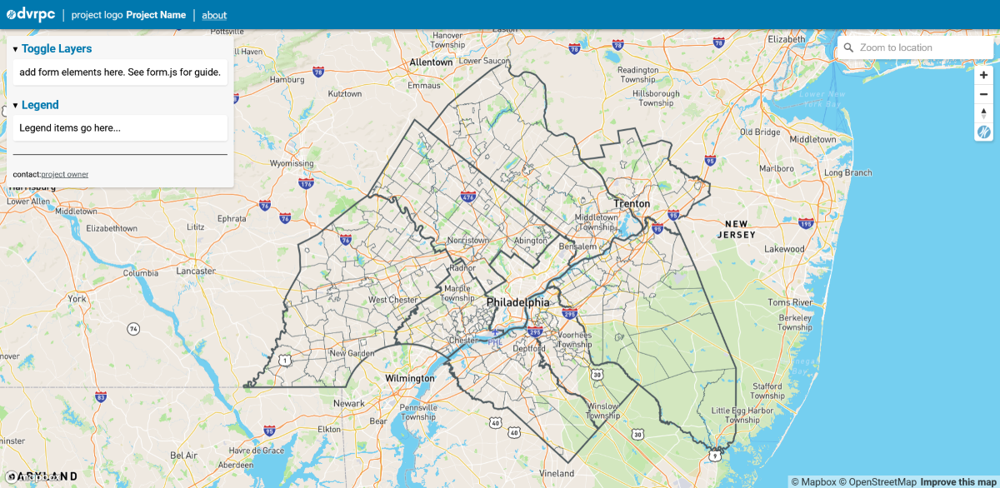

# Overlay Webmap Template

Copy this template to bootstrap a webmap with an overlay containing a form and legend area. Useful for projects with togglable and/or clickable layers that don't need space for text or data content.

  

## Set Up
- Initialize empty Git repo for new project
- Copy template directory to project root
- Fill out the `name` and `version` fields in `package.json`
    - (optional) fill out `description`, `author`, `repository: { url: ''}` and `keywords`
- `npm clean-install`
- Commit and push
- `npm start` to spin up the app

  

## Add Layers & Toggles
- Add default map layers to `/js/map/mapLayers.js`
    - default map layers are visible after the initial page load
    - DVRPC County and municipal boundaries are included as defaults in the templates
- Add secondary map layers to `/js/map/secondaryMapLayers.js`
    - secondary map layers aren't visible until they are toggled on by a user
    - lazy loading map layers via secondary map layers helps reduce initial load time
- Browse `/js/forms.js` and `/js/map/popup.js` for sample form handlers and popup configs
- The rest of the content, actions and styles are up to you. Happy hacking. 

  

## Deployment
- Make sure meta tags and OG tags are filled out
- `npm run build`
    - if this errors out, try `npm clean-install` to wipe and reset installed packages then `npm run build` again
- Copy files from `/build/` folder to deployment location.

  

## Demo
- Browse through the `/demo/` folder to get a sense of how everything hooks up to make a working map.
    - Webpack isn't configured for the `/demo/` folder but an instance of [Live Server](https://marketplace.visualstudio.com/items?itemName=ritwickdey.LiveServer) can deploy it
- View [a working demo here](https://dvrpc.github.io/map-templates/).